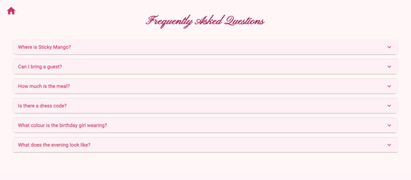

## Private Invitation & RSVP Web Application

This is a private, full-stack web application designed to manage invitations and collect RSVPs for Elaine’s 30th birthday dinner.
It provides a digital invitation experience while securely recording guest responses in a local database.

The application allows invited guests to confirm attendance, specify number of guests, and leave personal messages — all through a responsive, mobile-friendly interface.

### Key Features

- Digital invitation landing page
- RSVP submission form
- Attendance tracking (Yes / No)
- Guest count management
- Personal message collection
- Secure local database storage
- Mobile-responsive UI
- Private deployment model

### Frontend

- React
- TypeScript
- Vite
- Material UI (MUI)

### Backend

- Node.js
- Express.js
- SQLite

## How to Build & Run

#### Frontend

On root directory:

```
npm install
npm run dev
```

Runs on: http://localhost:8080

#### Backend

```
cd server
npm install
npx nodemon src/index.ts
```

Runs on: http://localhost:3000

---
## Key Features

- **Digital Invitation Landing Page**
  - Responsive hero section with event details (time, date, location)
  - Styled background and overlay for readability


- **RSVP Submission Form**
  - Collects guest name, attendance status, number of guests, and optional message
  - Validates input inline with error messages


- **Attendance Tracking**
  - Guests can respond with Yes/No.
  - Attendance count stored in database for easy tracking


- **Guest Message Collection**
  - Guests can leave personal messages with their RSVP


- **Secure Local Storage**
  - All RSVP submissions are stored locally in SQLite
  - No emails or third-party servers required


- **Optional Enhancements**
  - Google Calendar “Add Event” link for confirmed attendees
  - Confetti animation on successful “Yes” RSVP

---

## Tech Stack

- **Frontend**: React + TypeScript + Vite + MUI
	- **React**: for component-based architecture, enabling reusable UI components for RSVP forms, accordions, and confirmation flows
	- **TypeScript**: provides static type checking, reducing runtime errors and improving developer productivity
	- **Vite**: for fast bundling and development server with HMR (Hot Module Replacement)
	- **Material UI**: for consistent, responsive, and accessible UI components


- **Backend**: Node.js + Express + SQLite
	- **Node.js**: handles asynchronous HTTP requests efficiently
	- **Express.js**: simplifies API route creation and middleware handling
	- **SQLite**: provides a file-based, lightweight relational database perfect for small-scale, private event data. No external database service is needed


| Layer      | Technology         | Why                                                             |
| ---------- | ------------------ | --------------------------------------------------------------- |
| Frontend   | React + TypeScript | Component-based UI, type safety, maintainability                |
| Bundler    | Vite               | Extremely fast development server, ES module support            |
| UI Library | Material UI        | Prebuilt, responsive components for rapid prototyping           |
| Backend    | Node.js + Express  | Lightweight API server, good for asynchronous I/O               |
| Database   | SQLite             | Lightweight, file-based relational DB, perfect for private apps |

---





